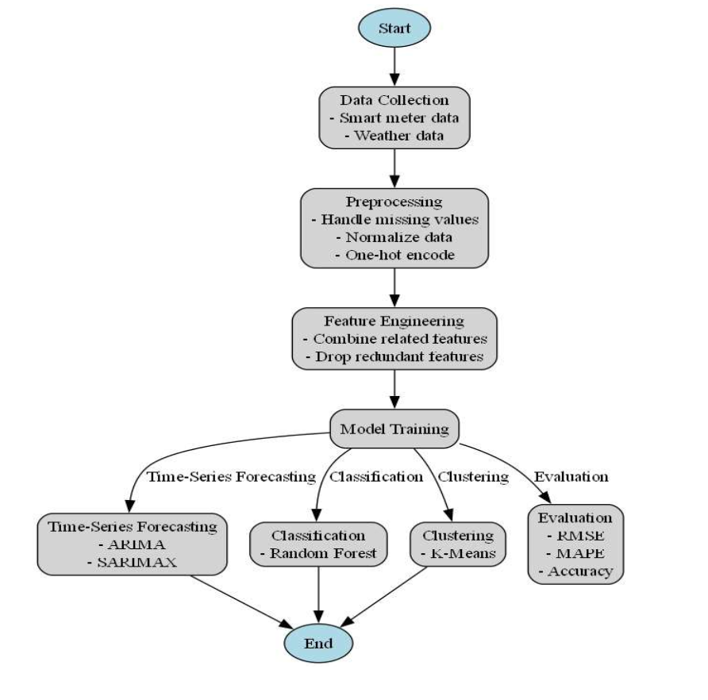
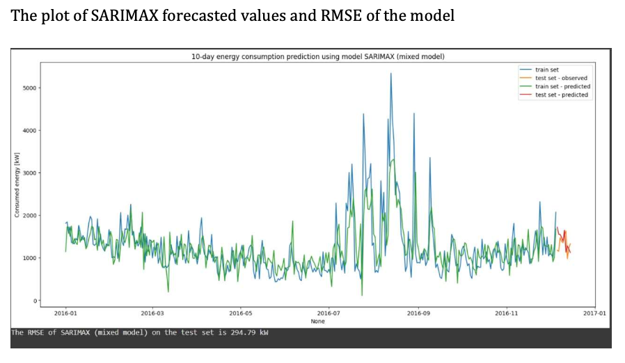
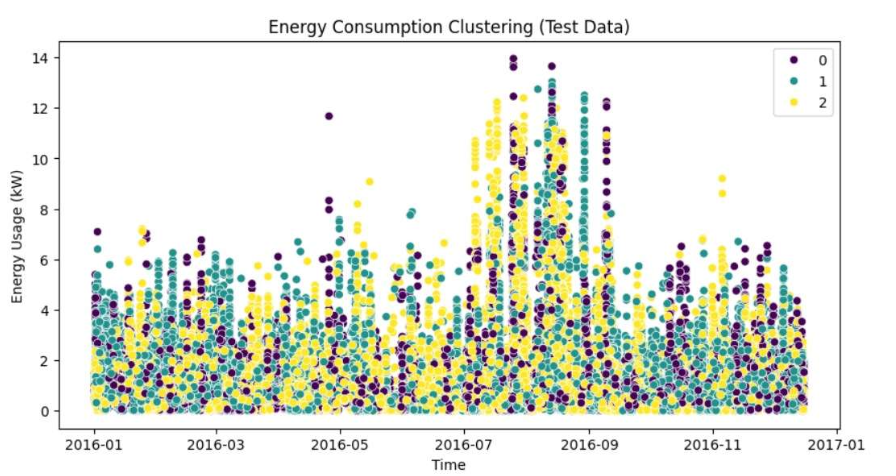
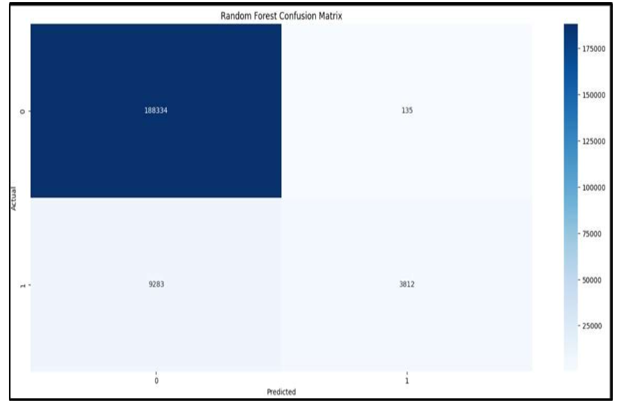

# Energy-Consumption-Analysis
A machine learning project to forecast energy consumption using time series analysis.
# Energy Consumption Forecasting for Smart Grid Optimization ⚡️

[](https://opensource.org/licenses/MIT)
[](https://www.python.org/downloads/release/python-390/)
[](https://jupyter.org/)

A comprehensive machine learning project that analyzes and forecasts household energy consumption to support smart grid optimization. This repository contains the full analysis, from data preprocessing to model evaluation, including time-series forecasting, customer segmentation, and efficiency classification.

---

## 📋 Table of Contents
- [Project Overview](#-project-overview)
- [Key Features](#-key-features)
- [Methodology](#-methodology)
- [Results & Visualizations](#-results--visualizations)
- [How to Run This Project](#-how-to-run-this-project)
- [Project Structure](#-project-structure)
- [Acknowledgments](#-acknowledgments)

---

## 🎯 Project Overview

As smart grids become more prevalent, accurately forecasting energy demand and understanding consumption patterns are critical for balancing supply and demand. This project tackles this challenge by applying a multi-faceted machine learning approach to a high-frequency dataset of household energy consumption and weather data. The core objectives are to forecast energy usage, segment consumers based on behavior, and identify inefficient consumption patterns.

---

## ✨ Key Features

- **Time-Series Forecasting**: Implemented **ARIMA** and **SARIMAX** models to predict future energy consumption, incorporating weather data (temperature, humidity) as exogenous variables to improve accuracy and interpretability.
- **Customer Segmentation**: Used **K-Means Clustering** to segment households into distinct groups based on their daily energy usage patterns, providing insights for targeted energy-saving campaigns.
- **Efficiency Classification**: Developed a **Random Forest Classifier** to distinguish between efficient and inefficient energy consumption, achieving an accuracy of **95.33%**.
- **In-Depth EDA**: Performed extensive Exploratory Data Analysis, including correlation analysis and feature engineering, to prepare the data for modeling.

---

## ⚙️ Methodology

The project follows a structured workflow, from data ingestion to model deployment and evaluation.

 

1.  **Data Collection**: Utilized a dataset containing minute-level smart meter readings and corresponding weather data.
2.  **Preprocessing**: Handled missing values, normalized numerical features using `MinMaxScaler`, and one-hot encoded categorical features.
3.  **Feature Engineering**: Combined related features (e.g., multiple furnace/kitchen readings) and dropped redundant or highly correlated columns.
4.  **Modeling**:
    -   **Forecasting**: Trained ARIMA and SARIMAX models on daily resampled data.
    -   **Clustering**: Applied K-Means to identify 3 distinct consumption clusters.
    -   **Classification**: Trained a Random Forest model to classify usage efficiency.
5.  **Evaluation**: Assessed model performance using metrics like **RMSE**, **MAPE**, and **Accuracy**.

---

## 📊 Results & Visualizations

The models provided significant insights into energy consumption patterns.

### Time-Series Forecast (SARIMAX)
The SARIMAX model, which included weather variables, successfully captured the trends and seasonality in the energy data.

 
- **ARIMA RMSE**: 273.41 kW
- **SARIMAX RMSE**: 294.79 kW
- While SARIMAX had a slightly higher RMSE, its ability to incorporate external factors makes it more robust and interpretable.

### Energy Consumption Clustering (K-Means)
K-Means successfully segmented users into three distinct clusters (Low, Medium, High consumption), enabling targeted demand-side management.

 

### Efficiency Classification (Random Forest)
The classifier demonstrated high performance in identifying inefficient usage patterns.
- **Accuracy**: 95.33%
- **Confusion Matrix**:
   

---

## 🚀 How to Run This Project

To replicate this analysis on your local machine, please follow these steps:

1.  **Clone the Repository**
    ```bash
    git clone [https://github.com/your-username/your-repo-name.git](https://github.com/your-username/your-repo-name.git)
    cd your-repo-name
    ```

2.  **Create a Virtual Environment** (Recommended)
    ```bash
    python -m venv venv
    source venv/bin/activate  # On Windows, use `venv\Scripts\activate`
    ```

3.  **Install Dependencies**
    A `requirements.txt` file is provided with all necessary packages.
    ```bash
    pip install -r requirements.txt
    ```

4.  **Launch Jupyter Notebook**
    ```bash
    jupyter notebook
    ```
    Then, navigate to the `notebooks/` directory and open `Energy_consumption_analysis.ipynb`.

---

## 🙏 Acknowledgments
- This project was completed under the guidance of **Prof. Sachin Kansal** at the Thapar Institute of Engineering & Technology.
- Dataset source and relevant academic papers are cited within the research paper.
